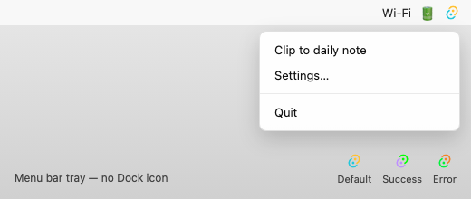
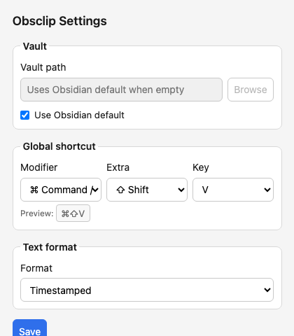

# Obsclip

Obsclip is a small menu-bar / system-tray utility that appends your current clipboard (text or image) to today's Obsidian daily note. It reads vault settings from disk and writes files directly — no Obsidian URI and no need to launch Obsidian.



## Features

- **One-action clip** — global shortcut or tray menu
- **Text and images** — images are saved to your vault attachment folder and linked with `![[...]]`
- **Obsidian-aware** — reads `obsidian.json`, daily-notes config, and attachment folder from `.obsidian/`
- **Auto vault detection** — uses Obsidian's last-open vault, with optional manual override
- **Tray-only on macOS** — stays in the menu bar, not the Dock
- **Visual feedback** — tray icon turns green on success, red on error

## Requirements

- **Obsidian** with **Daily notes** enabled
- **macOS** or **Windows**

> **Linux** is planned for v1.1. Platform paths are abstracted, but Linux is not supported yet.

## Install

### macOS (release build)

```bash
npm install
npm run tauri build -- --bundles dmg
```

Open `src-tauri/target/release/bundle/dmg/Obsclip_0.1.0_aarch64.dmg`, drag **Obsclip** to **Applications**, then launch it.

If macOS blocks the unsigned app:

```bash
xattr -cr /Applications/Obsclip.app
```

Or right-click the app → **Open** → **Open** again.

### Development

```bash
npm install
npm run tauri dev
```

## Usage

1. Copy text or an image to the clipboard.
2. Press the global shortcut or choose **Clip to daily note** from the tray menu.
3. Obsclip appends to today's daily note (creating it from your template if needed).

### Default shortcut

| Platform | Shortcut |
|----------|----------|
| macOS | `⌘⇧V` |
| Windows | `Ctrl+Shift+V` |

### Tray menu

- **Clip to daily note** — append clipboard to today's note
- **Settings…** — open the settings window
- **Quit** — exit Obsclip

### Clip feedback

After each clip, the tray icon briefly changes color — green for success, red for error (see bottom-right of the tray screenshot above).

## Settings

Open **Settings…** from the tray menu:



| Setting | Description |
|---------|-------------|
| **Vault** | Optional folder override, or **Use Obsidian default** to follow Obsidian's active vault |
| **Global shortcut** | Three pickers: primary modifier, extra modifier, and key (with live preview) |
| **Text format** | Timestamped (default), blockquote, bullet, or checkbox |

Click **Save** to apply shortcut and settings changes.

### Example text output (timestamped)

```markdown
- 16:27 — Pasted text from clipboard
```

### Example image output

Image saved to your configured attachment folder (e.g. `attachments/clip-2026-06-29-143052.png`):

```markdown
- 14:32 — ![[clip-2026-06-29-143052.png]]
```

## How vault detection works

Obsclip resolves the vault in this order:

1. Manual path from settings (if set)
2. `last_open` in `~/Library/Application Support/obsidian/obsidian.json` (macOS)
3. Vault marked `"open": true`
4. Only vault in the list
5. Most recently used vault (`ts`)

## Project structure

```
src-tauri/src/
  clip/          # format, image save, clip orchestration
  clipboard/     # read text/image from OS clipboard
  vault/         # Obsidian config + daily note paths
  tray.rs        # menu bar / tray UI
docs/screenshots/  # README images
```

## Tests

```bash
cd src-tauri && cargo test
```

Live vault integration test (optional):

```bash
cargo test --test live_clip -- --nocapture
```

## Regenerate screenshots

```bash
# Settings + tray menu mockups
npx playwright screenshot --viewport-size="420,480" \
  file://$PWD/docs/screenshots/settings-mockup.html docs/screenshots/settings.png
npx playwright screenshot --viewport-size="520,220" \
  file://$PWD/docs/screenshots/tray-mockup.html docs/screenshots/tray-menu.png

# Tray icon state PNGs
cd src-tauri && cargo test export_readme_icons -- --ignored --nocapture
```
