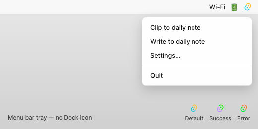
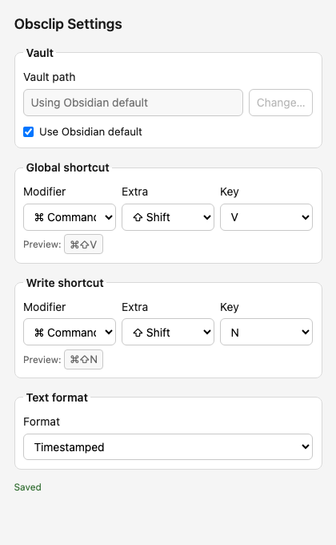

# Obsclip

Obsclip is a small menu-bar / system-tray utility that appends your current clipboard (text or image) to today's Obsidian daily note. It reads vault settings from disk and writes files directly — no Obsidian URI and no need to launch Obsidian.



## Features

- **One-action clip** — global shortcut or tray menu
- **Write to daily note** — global shortcut or tray menu opens a multiline box; typed text is appended with the same text format as clipboard clips
- **Text and images** — images are saved to your vault attachment folder and linked with `![[...]]`
- **Image OCR** — optionally extract text from clipboard images and append it indented under the image link (offline, bundled Tesseract)
- **Obsidian-aware** — reads `obsidian.json`, daily-notes config, and attachment folder from `.obsidian/`
- **Auto vault detection** — uses Obsidian's last-open vault, with optional manual override
- **Instant settings** — changes save automatically; vault is chosen via folder picker with validation
- **Tray-only on macOS** — stays in the menu bar, not the Dock
- **Visual feedback** — tray icon turns green on success, red on error
- **Optional note prompt** — add a short note when clipping (can be disabled in settings)

## Install (recommended)

Pre-built releases for macOS (Apple Silicon) and Windows. No Rust or Node required.

### macOS

```bash
curl -fsSL https://raw.githubusercontent.com/khoa-nguyen-bk18/obsclip/master/scripts/install.sh | bash
```

### Windows (PowerShell)

```powershell
curl.exe -fsSL https://raw.githubusercontent.com/khoa-nguyen-bk18/obsclip/master/scripts/install.ps1 -o $env:TEMP\obsclip-install.ps1; powershell -ExecutionPolicy Bypass -File $env:TEMP\obsclip-install.ps1
```

### Pin a version

```bash
OBSCLIP_VERSION=0.1.0 curl -fsSL https://raw.githubusercontent.com/khoa-nguyen-bk18/obsclip/master/scripts/install.sh | bash
```

```powershell
$env:OBSCLIP_VERSION="0.1.0"; curl.exe -fsSL https://raw.githubusercontent.com/khoa-nguyen-bk18/obsclip/master/scripts/install.ps1 -o $env:TEMP\obsclip-install.ps1; powershell -ExecutionPolicy Bypass -File $env:TEMP\obsclip-install.ps1
```

> **Unsigned builds:** macOS Gatekeeper may block manually opened apps; the install script clears quarantine automatically. On Windows, SmartScreen may warn on first launch — click **More info** → **Run anyway**.

Requires a [GitHub Release](https://github.com/khoa-nguyen-bk18/obsclip/releases) for your platform. See [Build from source](#build-from-source) if no release is available yet.

## Requirements

- **Obsidian** with **Daily notes** enabled
- **macOS** or **Windows**

> **Linux** is planned for v1.1. Platform paths are abstracted, but Linux is not supported yet.

## Build from source

For contributors or if no pre-built release exists for your platform.

### Prerequisites

Install these before building:

| Tool | macOS | Windows |
|------|-------|---------|
| [Node.js LTS](https://nodejs.org/) | ✅ | ✅ |
| [Rust](https://rustup.rs/) (`rustup`) | ✅ | ✅ |
| Xcode Command Line Tools (`xcode-select --install`) | ✅ | — |
| [Microsoft C++ Build Tools](https://visualstudio.microsoft.com/visual-cpp-build-tools/) with **Desktop development with C++** | — | ✅ |
| [WebView2 Runtime](https://developer.microsoft.com/en-us/microsoft-edge/webview2/) | — | ✅ |
| [CMake](https://cmake.org/) | ✅ | ✅ |

See the [Tauri prerequisites guide](https://v2.tauri.app/start/prerequisites/) if anything is missing.

> **OCR builds:** Image OCR statically links Tesseract via `kreuzberg-tesseract`, which requires **CMake** on your system. The first release build takes longer while Tesseract compiles; pre-built installers are ~20–30 MB larger than without OCR.

#### Windows setup (one time)

1. **Node.js LTS** — download from [nodejs.org](https://nodejs.org/) and install. Restart PowerShell, then check:
   ```powershell
   node -v
   npm -v
   ```
2. **Rust** — download and run [rustup-init.exe](https://rustup.rs/), accept defaults, then restart PowerShell:
   ```powershell
   rustc -V
   cargo -V
   ```
3. **Microsoft C++ Build Tools** — install [Build Tools for Visual Studio](https://visualstudio.microsoft.com/visual-cpp-build-tools/), check **Desktop development with C++**, finish install, restart if prompted.
4. **WebView2 Runtime** — install the [Evergreen Bootstrapper](https://developer.microsoft.com/en-us/microsoft-edge/webview2/#download-section) if it is not already on your system (Windows 11 usually has it).

Open **PowerShell** or **Developer PowerShell for VS** for the build steps below.

### macOS

```bash
git clone https://github.com/khoa-nguyen-bk18/obsclip.git
cd obsclip
npm install
npm run tauri build -- --bundles dmg
```

**Output:** `src-tauri/target/release/bundle/dmg/Obsclip_<version>_aarch64.dmg`

**Apple Silicon + Intel:** on Apple Silicon, the default build is `aarch64`. For a universal binary:

```bash
rustup target add x86_64-apple-darwin
npm run tauri build -- --target universal-apple-darwin --bundles dmg
```

**Unsigned app:** macOS may block the app because it is not notarized. Either right-click **Obsclip** → **Open** → **Open** again, or run:

```bash
xattr -cr /Applications/Obsclip.app
```

### Windows

From PowerShell:

```powershell
git clone https://github.com/khoa-nguyen-bk18/obsclip.git
cd obsclip
npm install
npm run tauri build -- --bundles msi
```

The first build can take several minutes while Rust compiles dependencies.

**Output:** `src-tauri\target\release\bundle\msi\Obsclip_<version>_x64_en-US.msi`

**Portable `.exe` installer** (no MSI):

```powershell
npm run tauri build -- --bundles nsis
```

Output: `src-tauri\target\release\bundle\nsis\`.

**Run without installing:** after any release build, the app binary is also at:

```
src-tauri\target\release\obsclip.exe
```

**MSI build fails (`light.exe` / VBSCRIPT):** enable **VBSCRIPT** under **Settings → Apps → Optional features → More Windows features**, then rebuild.

**SmartScreen:** unsigned builds may show “Windows protected your PC”. Click **More info** → **Run anyway**, or sign the installer with your own code signing certificate.

### Development

Run the app with hot reload while you work on it.

macOS / Linux:

```bash
npm install
npm run tauri dev
```

Windows (PowerShell):

```powershell
npm install
npm run tauri dev
```

## Usage

1. Copy text or an image to the clipboard.
2. Press the global shortcut or choose **Clip to daily note** from the tray menu.
3. If **Prompt to add a note** is enabled in settings, a small dialog appears with a one-line preview of what will be appended.
4. Obsclip appends to today's daily note (creating it from your template if needed).

To type a note instead of clipping the clipboard, press the write shortcut or choose **Write to daily note**. Enter starts a new line; `⌘↵` / `Ctrl+↵` inserts; Esc cancels. Empty submit closes without writing.

### Optional note dialog

When enabled in settings, clipping opens a compact dialog with:

- **Preview** — one-line preview of the formatted entry (truncated with `…` if long)
- **Note field** — optional text to append alongside the clip
- **Shortcuts**

| Action | macOS | Windows |
|--------|-------|---------|
| Clip (with or without note) | `⌘↵` | `Ctrl+↵` |
| Cancel (nothing appended) | `Esc` | `Esc` |

Leave the note field empty and press the clip shortcut to append clipboard content only. Any note text is trimmed before appending.

With the setting disabled, clipping works as before — no dialog, immediate append.

### Default shortcut

| Platform | Shortcut |
|----------|----------|
| macOS | `⌘⇧V` |
| Windows | `Ctrl+Shift+V` |

### Default write shortcut

| Platform | Shortcut |
|----------|----------|
| macOS | `⌘⇧N` |
| Windows | `Ctrl+Shift+N` |

### Tray menu

- **Clip to daily note** — append clipboard to today's note
- **Write to daily note** — open compose dialog to type and append text
- **Settings…** — open the settings window
- **Quit** — exit Obsclip

### Clip feedback

After each clip, the tray icon briefly changes color — green for success, red for error (see bottom-right of the tray screenshot above).

## Settings

Open **Settings…** from the tray menu:



| Setting | Description |
|---------|-------------|
| **Vault** | Shows the **active vault path** Obsclip is using (Obsidian default or your override). Use **Change…** to pick a folder, or **Use Obsidian default** to follow Obsidian's active vault. Settings save automatically — there is no Save button. |
| **Global shortcut** | Three pickers: primary modifier, extra modifier, and key (with live preview) |
| **Write shortcut** | Same three pickers for the compose dialog (default `⌘⇧N` / `Ctrl+Shift+N`) |
| **Prompt to add a note** | When enabled, show the optional note dialog before each clip |
| **Text format** | Timestamped (default), blockquote, bullet, or checkbox |
| **Extract text from images** | When enabled (default), run OCR on clipboard images and append recognized text indented under the image link. If OCR fails, the image still clips; a brief toast appears and Settings shows the error with a suggested fix. |
| **OCR languages** | Searchable list of Tesseract languages; enable up to **two** at a time (e.g. English + Vietnamese). **English** ships with the installer; other languages download on demand from Settings and work fully offline once installed. |

### Image OCR

- **Extract text from images** — toggle OCR for image clips (on by default).
- **Languages** — pick up to two active languages. English (`eng`) is bundled; search the list and use **Download** for any other language pack. Downloads are stored locally and work offline.
- If OCR is on but no language is enabled, or a selected pack is missing, Obsclip still saves the image and shows guidance in Settings.

### Vault setup

- The vault field always displays the **resolved path** — the folder Obsclip will actually write to — whether you use Obsidian default or a custom folder.
- **Change…** opens a native folder picker. The chosen folder must be an Obsidian vault (it must contain a `.obsidian` directory). If not, the vault field shows an error and nothing is saved until you pick a valid vault.
- On first launch, if Obsclip cannot resolve a vault (for example, Obsidian is not installed yet), a dialog prompts you to open Settings and choose a folder.
- Unchecking **Use Obsidian default** enables **Change…** so you can pick a custom vault. Checking it again switches back to Obsidian's active vault and saves immediately.

### Example text output (timestamped)

```markdown
- 16:27 — Pasted text from clipboard
```

With an optional note (`meeting follow-up`):

```markdown
- 16:27 — Pasted text from clipboard — meeting follow-up
```

### Example image output

Image saved to your configured attachment folder (e.g. `attachments/clip-2026-06-29-143052.png`):

```markdown
- 14:32 — ![[clip-2026-06-29-143052.png]]
```

With OCR enabled and text detected:

```markdown
- 14:32 — ![[clip-2026-06-29-143052.png]]
  Meeting notes from whiteboard
  Action item: ship OCR v1
```

With OCR and an optional note (`follow up`):

```markdown
- 14:32 — ![[clip-2026-06-29-143052.png]] — follow up
  Meeting notes from whiteboard
  Action item: ship OCR v1
```

## How vault detection works

Obsclip resolves the vault in this order:

1. Manual path from settings (if set and valid — must be an Obsidian vault with a `.obsidian` folder)
2. `last_open` in Obsidian config:
   - macOS: `~/Library/Application Support/obsidian/obsidian.json`
   - Windows: `%APPDATA%\obsidian\obsidian.json`
3. Vault marked `"open": true`
4. Only vault in the list
5. Most recently used vault (`ts`)

If no vault can be resolved, Obsclip shows a setup dialog at launch and displays an error in the Settings vault field until you choose a valid folder.

## Project structure

```
src-tauri/src/
  annotation.rs  # optional note dialog flow
  compose.rs     # write-to-daily-note compose dialog flow
  clip/          # format, image save, clip orchestration
  clipboard/     # read text/image from OS clipboard
  vault/         # Obsidian config + daily note paths
  tray.rs        # menu bar / tray UI
src/
  annotation.ts  # note dialog UI
  compose.ts     # compose dialog UI
docs/screenshots/  # README images
```

## Tests

macOS / Linux:

```bash
cd src-tauri && cargo test
```

Windows (PowerShell):

```powershell
cd src-tauri; cargo test
```

Live vault integration test (optional):

```bash
cargo test --test live_clip -- --nocapture
```

## Regenerate screenshots

```bash
# Settings + tray menu mockups
npx playwright screenshot --viewport-size="420,480" \
  file://$PWD/docs/screenshots/settings-mockup.html docs/screenshots/settings.png
npx playwright screenshot --viewport-size="520,220" \
  file://$PWD/docs/screenshots/tray-mockup.html docs/screenshots/tray-menu.png

# Tray icon state PNGs
cd src-tauri && cargo test export_readme_icons -- --ignored --nocapture
```

## Contact

For bug reports, feature requests, or general questions, email [khoa.nguyen.bk18@gmail.com](mailto:khoa.nguyen.bk18@gmail.com).
